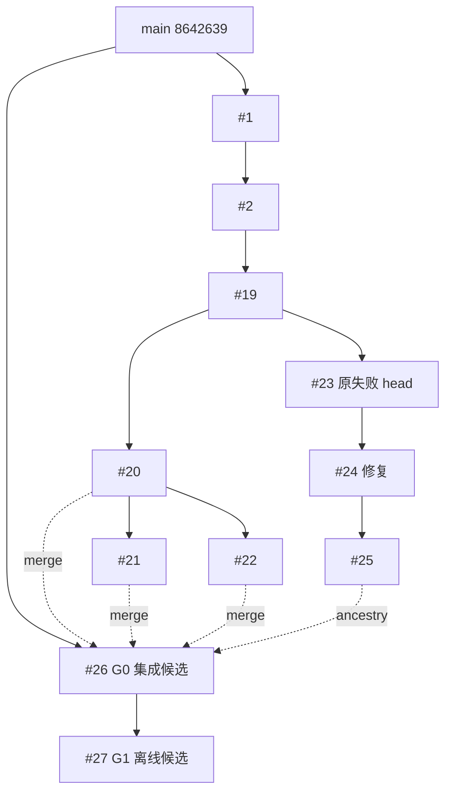

# V2.0 G0/G1 当前状态复核与离线修复计划

审计时间：2026-10-10T19:41:15Z。依据外部执行手册及 GitHub/本地当前状态；历史快照保持不变。

## 基线差异

- 执行手册 SHA-256：`A31A70795C02B9F5BE3ED505361AA3133ADFE82DA09DDD18DE8FE5D482841B4D`。
- 手册写明 25 个开放 PR；本次 REST 查询到 **27 个开放 PR、0 个已合并 PR**。新增候选为 #26（G0 集成）和 #27（G1 离线响应契约）。
- GitHub `main` 仍为 `8642639a78ca9aa56fbad1e88aea4b82169ea433`。
- 手册中的 PR #25 head `fdaa380918bde8afcc68976855824eea323f7405` 是当前 head `97d138fc3f8072668af1bbeada3475d612f55a7d` 的祖先；分支继续前进，没有替换历史提交。
- 最新机器快照 [`PR-INTEGRATION-MATRIX-LIVE-20261010T194115Z.json`](PR-INTEGRATION-MATRIX-LIVE-20261010T194115Z.json)，SHA-256 `f933c0e4ff3c21bda8e806bf1d4faee865af80664fa975b332c01c640fbbc4ec`。它保存全部 PR 的 base/head、依赖、changed files、测试文件、精确 head check-runs、合并状态，以及 #26/#27 的 review count。
- 当前 worktree：`codex/v2-g1-offline-20261010@9eb55ac19b7e8739b7500cca03b0c9d2a253c299`，审计开始时干净；本报告与矩阵是新增文件。PR #26/#27 都是 OPEN/Draft、0 reviews、未合并、auto-merge 关闭。

## G0 — 集成与基线

### 分支依赖与覆盖

Git ancestry 逐项复核证明：PR #26 head `ffc265be9bdcb1f97aef5c80d572636ca9cef035` 包含 PR #1–#25 当前 head 的全部 25 个提交。候选基于 `main`，合并 PR #20/#21/#22 分叉并携带 PR #23/#24/#25 线。候选相对 main 有 211 个文件改动、32,086 行新增、514 行删除。

本地 G0 对照证据仍可复核：baseline worktree 在 `main@8642639...`，候选 worktree 在 `ffc265...`；JUnit SHA 分别为 `EC187FB87F395A5BB3949D358B13614B73DACFBFA873DC7D8A451EF54374CA9B` 和 `DAD101A071100B00D9071936E13233F1EFCFA8813E82A1ACD3D29FBBE9C0A733`。已记录的同环境 node-id 差集为 0 个新增失败、0 个基线节点缺失；候选 2,517 passed / 1 skipped，baseline 2,113 passed / 103 inherited failures / 1 skipped。两个 XML 仍在各自 worktree，未上传。

### 最新 CI 与判定

- PR #26 精确 head `ffc265...` 的 run [38043671492](https://github.com/LJ0930l-beep/AI_Market_Analyst/actions/runs/38043671492) 通过：quick 222 passed、full 2,518 passed。
- PR #23 原始 head `5831f9785e5f8b09d6a819c562949beceb6db4b0` 仍保留失败 run [37963206552](https://github.com/LJ0930l-beep/AI_Market_Analyst/actions/runs/37963206552)，3 个 `tests/test_macro_actuals.py` 失败；PR #24 的后代修复及 #26/#27 的绿 CI 不重写该历史结果。
- 当前 27 个 PR head 检查：15 个全成功、#23 一个失败、#1–#11 共 11 个没有 current-head check runs、0 个进行中。

**G0 判定：`FIX_IN_REVIEW`。** 候选 ancestry、文件覆盖、同环境基线对照和精确 head CI 已有证据；尚缺 PR #26/#27 人工审查和明确合并决定。不得自动合并或关闭源 PR。

## G1 — V38 响应可靠性

只读重核历史 ledger：144 行、512,044 bytes，SHA-256 仍为 `820212a5699b718c922232c584fcfdcb4f79b675ea8653b1898a0d4025b837a7`。72 dispatch intents 有 71 个 terminal results：67 `INVALID_JSON`、4 `CALL_ERROR_NO_RETRY`、1 个未匹配 ambiguous intent；原始 valid analyses 为 0。67 条内容全部是完整单层 JSON Markdown fence，finish reason 均为 stop；旧状态不可改写。67 条 usage 的 prompt/completion/total 算术全部不一致，实际账单费用未知。原始 HTTP response body 未留存；因此无法从这批账本证明代理是否真正执行 `response_format`、底层权重身份、重放幂等或实际扣费。旧 ambiguous intent 永不重发。

本地 Prompt/Schema V2 与 parser 负例只证明本地契约，保持远程 dispatch 关闭。新查出的 stored-input `evidence_refs` 自验证缺陷已由 commit `9eb55ac19b7e8739b7500cca03b0c9d2a253c299` 修复：schema/context、排序/唯一性、格式与顶层/分 timeframe 引用绑定均 fail closed。该 commit 精确 head hosted run [38078606379](https://github.com/LJ0930l-beep/AI_Market_Analyst/actions/runs/38078606379) 通过：quick 275 passed；全量 2,571 passed、1 条 Starlette 弃用警告、25 subtests。提交钩子本地 full suite 是 2,570 passed、1 skipped、0 failed；V38 专项为 198 passed。

**G1 离线判定：通过。G1 远端能力判定：`MODEL_OUTPUT_CONTRACT_BLOCKED`。** Schema/native response-format 能力、模型实际权重、provider 计费和 67 条 usage 不一致仍未验证。旧 72-intent 与独立格式 pilot 的授权均不可复用；G2 是新授权门槛，不在本次执行。

## 阻塞分级与当前登记

| 总纲预案 | 当前状态 | 登记与保底 |
|---|---|---|
| B01/B02：历史响应格式、空/截断 | 67 条为完整 fenced JSON，finish=stop；V2 对空/部分/截断有离线负例 | B-002/S1；冻结原账本，不清洗或重试 |
| B03/B04：结构化输出能力、响应身份 | 本地 V2 明确 reported fields match；不等于 provider 权重证明或 native schema 能力 | B-002/S1，保持远端能力 unknown |
| B05：远程身份与权重摘要 | calibration 要求 weight digest；缺失时 `MODEL_DIGEST_UNAVAILABLE`，没有显式 remote-identity evidence mode | 新登记 B-003；G4 前只做离线设计和 fake-provider 负例 |
| B07/B08：费用未知、ambiguous | 67 usage 算术异常、费用未知；一个 intent 无终态 | B-002/S1，禁止重放，账单记 UNKNOWN |
| B21/B22：CI 与分叉依赖 | #23 原始失败保留；#26 候选集成全 PR ancestry 且精确 head CI 通过 | B-001/S1；不以候选绿灯改写 #23 |

完整故障字段、首次证据与回滚在 [`B-001`](../blockers/B-20261010-001-pr-branch-integration.md)、[`B-002`](../blockers/B-20261010-002-model-response-capability.md)、[`B-003`](../blockers/B-20261010-003-calibration-identity-evidence.md) 登记。尚未触发的 B09–B20、B23–B26 不伪造事件；后续出现时按手册流程新增记录。

## 依赖顺序与解锁条件

1. **现在：**保持 G0 `FIX_IN_REVIEW`；等 PR #26/#27 人工审查。若收到变更意见，只在隔离分支修复，保留原始 PR 与失败 SHA，并为新精确 head 重跑 quick/full CI。
2. **G1 离线已通过；G1 provider 能力仍阻塞。** 旧 72 intents 与 one-intent format pilot 均不提供新调用额度。任何 G2 2–4 样本实验都必须有新的明确授权、冻结新实验范围、请求上限、费用/额度停止规则、provider/route 身份证据；现在没有授权，不发送模型请求。
3. **G3 未开始：**先定义盲评 schema、两名独立评审、一致性门槛和固定基线；validation/untouched_test 继续封存。不得将可解析率说成交易质量。
4. **G4 依赖 G2/G3：**先离线设计 `REMOTE_RESPONSE_IDENTITY` 与 `LOCAL_ARTIFACT_SHA256` 分离的校准契约，明确 `weights_exposed=false` 时不能伪造 digest，研究/模拟和 Live 权限不同。未完成负例前 calibration 保持 `NOT_READY`。
5. G5–G7 依赖上游 Gate；当前不做 TestNet 写请求、Live、组合产品启用或发布动作。

## 本次边界

本次只读 GitHub/仓库/冻结账本并新增版本化审计文档。没有 Gemini、Gate/TestNet/Live API 调用、模型付费、订单、PR 合并、生产账户或资金/杠杆修改。V35 风控、V25/V37 历史数据、V38 ledger 与旧快照保持不变。
